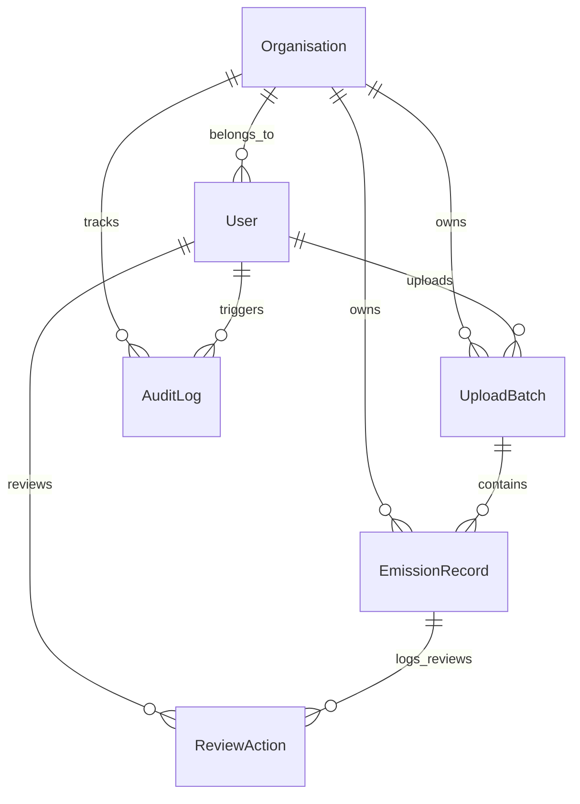

# Database Data Model Documentation

This document describes the relational database schema developed for the multi-tenant ESG Ingestion & Audit Platform.

## Database Schema Diagram (Logical)

---

## Model Definitions

### 1. Organisation (`tenants.Organisation`)
Represents the tenant in our multi-tenant SaaS architecture. All user accounts, upload batches, emission records, and audit logs are bound directly or indirectly to a specific organisation to ensure total data isolation.

| Field Name | Type | Constraints | Description |
| :--- | :--- | :--- | :--- |
| `id` | UUID | Primary Key, default=uuid4 | Unique tenant identifier. |
| `name` | CharField(255) | Required | Commercial name of the client. |
| `slug` | SlugField(100) | Unique | URL slug used for tenant subdomains or header identification. |
| `plan` | CharField(50) | Choices: `standard`, `enterprise` | Controls service limits and features. |
| `is_active` | BooleanField | Default: `True` | Kill-switch to deactivate access. |
| `created_at` | DateTime | Auto | Timestamp of onboarding. |

---

### 2. User (`auth_ext.User`)
Custom user model extending Django's standard `AbstractUser`. Includes role definitions and maps the user to their organisation.

| Field Name | Type | Constraints | Description |
| :--- | :--- | :--- | :--- |
| `id` | UUID | Primary Key, default=uuid4 | Unique user ID. |
| `organisation` | ForeignKey | Nullable, Cascade | Tenant reference. Null for global system admins. |
| `role` | CharField(20) | Choices: `admin`, `analyst`, `viewer` | Role-Based Access Control configuration. |

**Role Permissions Matrix:**
- **Admin**: Can create users, list and manage organizations, configure settings, and perform record reviews.
- **Analyst**: Can view dashboards, upload files, write review comments, and Approve/Reject/Flag emission records.
- **Viewer**: Read-only access to Dashboards, Ingestion status, and Emission lists. Review actions and upload tools are disabled.

---

### 3. Upload Batch (`ingestion.UploadBatch`)
Tracks files uploaded to the platform, their parsing status, and record count statistics.

| Field Name | Type | Constraints | Description |
| :--- | :--- | :--- | :--- |
| `id` | UUID | Primary Key | Unique batch ID. |
| `organisation` | ForeignKey | Cascade | Tenant isolation scope. |
| `source_type` | CharField(20) | Choices: `SAP`, `UTILITY`, `TRAVEL` | Specifies which parser/normaliser registry to use. |
| `file_name` | CharField(255) | Required | Name of the raw CSV file. |
| `file` | FileField | path: `uploads/%Y/%m/` | Reference to stored file. |
| `status` | CharField(20) | Choices: `PENDING`, `PROCESSING`, `COMPLETED`, `FAILED` | State machine tracking. |
| `error_message` | TextField | Nullable | Stacktrace or parser error messages. |
| `total_rows` | IntegerField | Default: 0 | Number of raw records in file. |
| `processed_rows` | IntegerField | Default: 0 | Successfully parsed and saved items. |
| `failed_rows` | IntegerField | Default: 0 | Invalid rows skipped during processing. |
| `uploaded_by` | ForeignKey | SET_NULL | Analyst who initiated ingestion. |

---

### 4. Emission Record (`emissions.EmissionRecord`)
The core data entity storing activity records, parsed data parameters, calculations, and review state.

| Field Name | Type | Constraints | Description |
| :--- | :--- | :--- | :--- |
| `id` | UUID | Primary Key | Unique record ID. |
| `batch` | ForeignKey | Cascade | Reference to ingestion batch. |
| `organisation` | ForeignKey | Cascade | Tenant isolation scope. |
| `activity_description` | CharField(500) | Required | Human-readable explanation of activity. |
| `quantity` | DecimalField(18, 4)| Required | Raw numerical quantity. |
| `raw_unit` | CharField(50) | Required | Unit alias specified in file (e.g. `ltr`, `L`, `kWh`). |
| `fuel_type` | CharField(100) | Nullable | Fuel classification (e.g. `diesel`, `natural gas`). |
| `travel_class` | CharField(20) | Nullable | Cabin class (e.g. `business`, `economy`, `first`). |
| `plant_code` | CharField(50) | Nullable | Facility/facility code from source. |
| `source_ref` | CharField(255) | Nullable | Unique transaction reference from source system. |
| `category` | CharField(100) | Nullable | Expense / GL category. |
| `period_start` | DateField | Nullable | Activity duration start. |
| `period_end` | DateField | Nullable | Activity duration end. |
| `normalised_qty_kg_co2e` | DecimalField(18, 4)| Nullable | Computed carbon footprint in kg CO2e (Normalised quantity × factor). |
| `canonical_unit` | CharField(50) | Default: `kg_CO2e` | Unified measurement standard. |
| `emission_factor` | DecimalField(10, 6)| Nullable | Specific factor used for calculations. |
| `scope` | CharField(1) | Choices: `1`, `2`, `3` | GHG Protocol Scope classification. |
| `is_suspicious` | BooleanField | Default: `False` | True if any Rule Engine checks fail. |
| `suspicious_reasons` | JSONField | Default: `list` | Array of triggered rule details. |
| `review_status` | CharField(20) | Choices: `PENDING`, `APPROVED`, `REJECTED`, `FLAGGED` | Review workflow stage. |
| `reviewed_by` | ForeignKey | SET_NULL | Analyst who signed off on record. |
| `reviewed_at` | DateTime | Nullable | Sign-off timestamp. |
| `is_locked` | BooleanField | Default: `False` | Once `True` (Approved), record is read-only. |

**Indexes Optimization:**
- `Index(organisation, review_status)`: Accelerates analyst queues.
- `Index(organisation, scope)`: Speeds up dashboard aggregations.
- `Index(batch)`: Fast retrieval of records within a single upload.
- `Index(organisation, is_suspicious)`: Immediate retrieval of flagged anomalies.

---

### 5. Review Action (`review.ReviewAction`)
A historical ledger tracking actions (comments, flags, approvals) performed on each record.

| Field Name | Type | Constraints | Description |
| :--- | :--- | :--- | :--- |
| `id` | UUID | Primary Key | Unique action ID. |
| `record` | ForeignKey | Cascade | Related emission record. |
| `actor` | ForeignKey | Cascade | User who performed action. |
| `action` | CharField(20) | Choices: `APPROVE`, `REJECT`, `FLAG`, `COMMENT` | Type of action taken. |
| `comment` | TextField | Nullable | Auditor review justification or comment. |
| `created_at` | DateTime | Auto | Timestamp of activity. |

---

### 6. Audit Log (`audit.AuditLog`)
Immutable history of system-wide changes, capturing structural modifications (including data diffs) for auditor verification.

| Field Name | Type | Constraints | Description |
| :--- | :--- | :--- | :--- |
| `id` | UUID | Primary Key | Log identifier. |
| `organisation` | ForeignKey | Cascade | Tenant reference. |
| `actor` | ForeignKey | SET_NULL | User reference. |
| `actor_email` | EmailField | Required | Denormalised actor email (preserved even if User is deleted). |
| `entity_type` | CharField(100) | Required | Changed model name (e.g. `EmissionRecord`). |
| `entity_id` | CharField(100) | Required | ID of mutated row. |
| `action` | CharField(100) | Required | Trigger event (e.g. `RECORD_APPROVE`). |
| `diff` | JSONField | Default: `dict` | Before-and-after mapping of edited fields. |
| `ip_address` | GenericIPAddress | Nullable | IP address of request. |
| `user_agent` | CharField(500) | Nullable | Browser signature of request. |
| `created_at` | DateTime | Auto | Immutable creation timestamp. |

---

## Design Rationale

1. **UUIDs for Keys**: Prevents sequential enumeration attacks, ensuring tenants cannot guess IDs of other organisations' records.
2. **Denormalised Fields (Audit Log)**: The audit log stores `actor_email` directly. If a user is deleted from the database, the audit trail retains their email address, satisfying strict financial and environmental compliance requirements.
3. **Audit Lock**: When a record's `review_status` transitions to `APPROVED`, `is_locked` is marked `True`. Any subsequent `save` calls check this flag and block modifications, ensuring data immutability before external audit.
